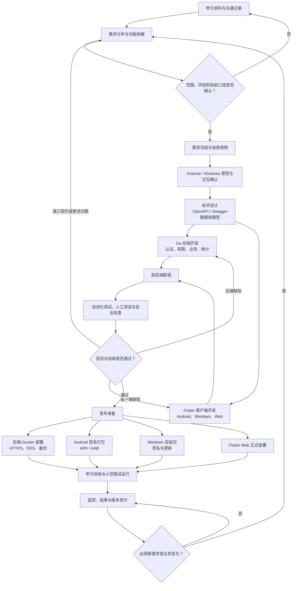

# ProjectF 一期项目路线图

> 本文是阶段级路线图，不是逐文件实施计划。需求规格审阅通过后，再创建可以直接执行的详细任务计划。

## 项目开发流程图



这套流程不是一次性瀑布开发：需求变更回到需求分析，测试失败回到对应开发分支；Go 与 Flutter 在 API 契约确定后并行推进。

## 各阶段主要产物

| 阶段 | 主要产物 |
|---|---|
| 需求分析 | 需求基线、功能清单、待确认问题、验收场景 |
| 原型确认 | Android 纵向表单、Windows 宽表交互原型 |
| 技术设计 | OpenAPI/Swagger、数据库模型、权限矩阵、部署结构 |
| 并行开发 | Go API、Flutter Android/Windows、自动化测试 |
| 联调测试 | 缺陷记录、回归结果、发布候选版本 |
| 发布交付 | Docker 服务、APK/AAB、Windows 安装包、运维说明 |

## 1. 总体原则

- Android 是主要交付物，Windows 和 Web 同为一期正式交付物。
- 先冻结业务规则，再冻结原型和数据模型。
- 使用同一个 Flutter 工程共享业务逻辑，不建立三套前端。
- 按“可工作的纵向切片”推进，每一阶段都能演示，而不是分别堆完前端和后端后才联调。
- Redis、Web、高级统计等非核心能力不得阻塞主业务闭环。

## 2. 阶段 0：需求基线与甲方确认

### 目标

把最新 Word、Excel 和沟通结论转换成唯一需求基线。

### 工作内容

- 审阅 `docs/output/需求.md`。
- 逐项处理 `docs/output/测试验收.md` 中的待确认事项。
- 确认入库、出库、结算和审批状态。
- 确认付款、收款、开票是否允许分次记录。
- 确认提醒规则、统计口径和打印导出要求。

### 完成标准

- 不存在会改变核心数据模型的未决问题。
- 甲方确认一期范围和不包含事项。
- 验收标准可以被测试用例验证。

## 3. 阶段 1：主人学习与开发环境

### 目标

主人可以独立运行、调试和理解最小 Flutter 工程。

### 工作内容

- 学习 Dart 基础、空安全和异步。
- 安装 Flutter、Android Studio、Android SDK。
- 安装 Visual Studio 2022 的 C++ 桌面开发组件和 Windows SDK。
- 运行 `flutter doctor` 并解决阻塞项。
- 分别运行 Android 模拟器和 Windows 示例程序。

### 完成标准

- 能修改一个 Widget 并看到热重载结果。
- 能在 Android 与 Windows 启动同一个 Flutter 工程。
- 能读懂简单的 Dart 数据类和 `async/await`。

## 4. 阶段 2：静态原型与交互验证

### 目标

先验证表单在手机和 PC 上是否易用，不连接真实后端。

### 工作内容

- 制作登录、首页、入库、出库、历史、结算申请、审批和汇总低保真原型。
- Flutter 实现静态入库页面。
- Android 使用纵向分区布局。
- Windows 使用默认 5 行的桌面宽表布局。
- 验证动态增加公司、客户和产品行的交互。
- 验证三种辅助填写模式。

### 完成标准

- 甲方可以在真机和 Windows 演示程序中完成模拟填单。
- 字段、按钮、信息层级和滚动方式获得确认。
- 原型不依赖硬编码 Excel 像素位置。

## 5. 阶段 3：工程骨架与后端基础

### 目标

建立可持续扩展的客户端、服务端、数据库和部署骨架。

### 工作内容

- 创建 Flutter feature-first 工程结构。
- 接入 Riverpod、GoRouter、Dio 和统一错误处理。
- 创建 Go 单体工程、配置、日志和健康检查。
- 建立数据库迁移机制。
- 建立用户、组、成员、会话和权限基础表。
- 编写 OpenAPI 基础契约。
- 配置本地 Docker Compose 开发环境。

### 完成标准

- Android 和 Windows 可以登录同一套本地 API。
- 后端可以正确识别用户和当前组。
- 跨组访问测试被拒绝。
- 数据库可以从空库通过迁移创建。

## 6. 阶段 4：入库纵向切片

### 目标

完成第一个真实可用的端到端业务闭环。

### 工作内容

- 辅助填写字典及管理状态。
- 入库单创建、草稿、查看、编辑和提交。
- 动态公司组和产品明细。
- 明细选择含税价或不含税价，并按稳定代码保存。
- 单价 × 数量、公司小计和总金额。
- Windows 人民币金额大写。
- 付款和开票状态。
- 权限和审计日志。

### 完成标准

- Android 与 Windows 创建的数据完全一致。
- 后端重新计算金额，不信任客户端合计。
- 业务员默认只能访问本人单据。
- 主账号作为组内管理员，可以访问组内全部单据。

## 7. 阶段 5：出库纵向切片

### 目标

完成出库及收款管理。

### 工作内容

- 客户、电话、出货单位辅助填写。
- 出库单创建、草稿、查看、编辑和提交。
- 动态客户产品明细。
- 销售金额类型选择。
- 明细选择含税价或不含税价。
- 自动金额、总额和人民币大写。
- 收款状态和收款方式。

### 完成标准

- 三类销售金额可以被后台分别汇总。
- 未收款金额计算正确。
- 历史数据可以按客户、日期和业务员查询。

## 8. 阶段 6：结算与审批

### 目标

形成业务员申请、后台生成和审批的闭环。

### 工作内容

- 选择入库单、出库单。
- 自动生成结算单和数据快照。
- 计算进项合计、销售合计和毛利润。
- 待审批、通过、驳回状态。
- 驳回原因和审批审计。
- 审批结果消息。

### 完成标准

- 结算单可以追溯到所有源单。
- 修改源单不会改变已审批结算单快照。
- 无审批权限用户无法调用审批接口。

## 9. 阶段 7：后台汇总与账号治理

### 目标

完成公司管理和数据查看能力。

### 工作内容

- 按年、月、业务员汇总入库和出库。
- 付款、收款、开票和利润查询。
- 公司与业务员总结算单。
- 成员邀请、移除和权限配置。
- 平台运营创建、停用组并指定或更换主账号。
- 审计日志查询。

### 完成标准

- 后台结果可以与测试数据人工核对。
- 权限变更能够及时生效。
- 每项关键操作均可从审计日志追溯。

## 10. 阶段 8：Android 离线与同步

### 目标

断网不丢失业务员填写内容，联网后不产生重复数据。

### 工作内容

- Drift 数据库。
- 本地草稿。
- Outbox 待同步队列。
- 网络恢复重试。
- 幂等键。
- 版本冲突提示。
- 同步状态页面。

### 完成标准

- 飞行模式下可以创建和修改草稿。
- 重复点击同步不会创建重复单据。
- 冲突不会静默覆盖服务器数据。

## 11. 阶段 9：系统测试与试运行

### 目标

在发布前验证业务、权限、数据和多端一致性。

### 工作内容

- Go 单元和集成测试。
- Flutter 单元、Widget 和端到端测试。
- 权限矩阵测试。
- 弱网、断网和重复提交测试。
- 数据库备份与恢复演练。
- 小范围真实用户试运行。

### 完成标准

- 核心验收用例全部通过。
- 无已知高风险越权和数据丢失问题。
- 试运行反馈完成分类与修复。

## 12. 阶段 10：发布

### 工作内容

- 部署 HTTPS API。
- 创建并保管 Android 签名密钥。
- 构建 APK/AAB。
- 构建 Windows Release 和安装包。
- 配置版本检查和下载地址。
- 编写部署、回滚、备份和用户操作说明。
- 部署 Flutter Web 正式版本并纳入一期验收。

### 完成标准

- 新设备可以完成安装、登录和核心业务流程。
- 服务故障有明确恢复步骤。
- 版本和数据库迁移可以回滚或修复。

## 13. 推荐开发节奏

每个业务切片遵循：

```text
确认验收用例
→ 写后端失败测试
→ 实现最小后端
→ 写 Flutter 状态/组件测试
→ 实现 Android/Windows UI
→ 联调
→ 真机和 Windows 验证
→ 更新文档
```

详细到文件、命令和测试代码的实施计划，在本轮设计文档审阅通过后单独生成。

## 14. Dart / Flutter 学习主线

主人可以让学习进度与项目阶段同步，不需要先学完整套 Flutter 再开始项目：

1. **Dart 基础**：空安全、类、集合、`Future`、`async/await` 和 JSON。
2. **Flutter UI**：Widget、布局、表单、滚动、焦点和校验。
3. **跨端布局**：Android 纵向卡片与 Windows 宽表共用同一数据模型。
4. **状态管理**：Riverpod、不可变状态、加载和错误状态。
5. **网络通信**：Dio、OpenAPI 模型、JWT 刷新和统一错误处理。
6. **离线同步**：Drift、SQLite、Outbox、幂等键和冲突处理。
7. **发布能力**：Android 签名、Windows 安装包及 Web 正式部署。

第一个练习直接实现“入库单本地原型”：动态增加产品、自动编号、选择含税价/不含税价、单价 × 数量、自动总金额，以及 Android/Windows 两种布局。完成后再接 Riverpod 和 Go API。
